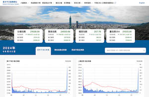

<br>
<div align="center">
  
</div>
<div align="center">
  <h1 >基本市況報導網站 MIS WEB</h1>
    <p><u>臺灣證券交易所</u> 委託 <u>雲端行動科技</u> 開發的股票市況查詢網站。</p>

       


</div>

## 開發環境

 |              | 連結                                              | 狀態     |
 | ------------ | ------------------------------------------------- | -------- |
 | 正式版       | https://mis.twse.com.tw/stock/index.jsp           | online   |
 | 測試版       | https://mistest.twse.com.tw/stock/index           | online   |
 | 外部表單網站 | https://www.twse.com.tw/zh/index.html#index-chart | online   |
 | 舊網站       | https://mis.twse.com.tw/stock/index.jsp           | 已被取代 |

## 安裝 Install

本專案 Node.js 版本建議為 `20.15.0`
其餘版本建議請至[版本建議文件](./docs/notes/PrejectPlugin.md)查看

### 移動到桌面(windows系統可忽略)

```bash
cd Desktop
```

### 取得專案

```bash

git clone git@git.ecloudmobile.com:ecloudmobile/mis-web.git
```

### 移動到專案內

```bash
cd mis-web
```

```bash
nvm install
```

### 運行專案

```bash
npm run dev
```

### 部署

package.json 有設定prebuild，再執行build之前會先執行一次npm install ，避免後端部署時沒有更新到最新版本的套件

```bash
npm run build
```

## 開發人員

|       |                                                                      |
| ----- | -------------------------------------------------------------------- |
| UI/UX | Gordon                                                               |
| 前端  | Donna (開發)、 jocelyn (協助)、sherrychen (協助) 、Evan (協助／維護) |
| 後端  | Jog                                                                  |
| PM    | 小胖                                                                 |

## 開發文件

|           |                                                                                                               |
| --------- | ------------------------------------------------------------------------------------------------------------- |
| WireFrame | [axure](https://r920km.axshare.com/?id=1ly9i1&p=%E8%AD%89%E4%BA%A4%E6%89%80mis_%E9%A6%96%E9%A0%81&sc=3)       |
| 設計稿    | [Zeplin](https://app.zeplin.io/project/652604770a367e207f26e900)                                              |
| API file  | [Google docs](https://docs.google.com/spreadsheets/d/1MBdMhy35deErrCwuCzzPOsbp008P1atGjfz6EAogrbg/edit#gid=0) |  |

## 資料夾說明

詳情請至[資料夾說明文件](./docs/notes/FileDescription.md)查看
(檔案太多了)

## 頁面預覽

詳情請至[頁面預覽文件](./docs/notes/PagePreview.md)查看